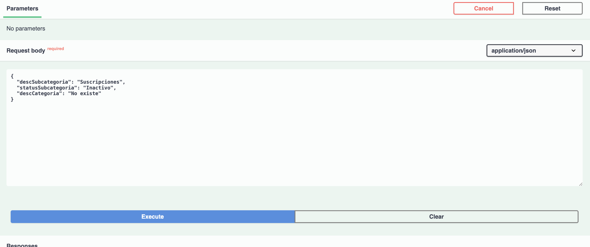
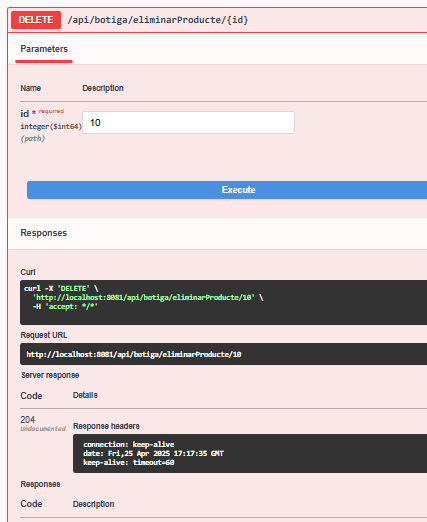

# DMC-ActivitatBotiga

Generar un controlador REST a partir del controlador actual de l’aplicació web, afegint algunes noves funcionalitats.
Canviar l’ús de les entitats al controlador per DTO’s i mapejos fent servir MapStruct.
Provar l’API amb swagger.

1 REST API
Controllers
12 Endpoints

1 DTOS MAPPERS
dependencies
properties
entitats - JPA

- Categoria
  Posar camps correctes
- Subcategoria
  Posar camps
  Relacio
  1 to N Categoria - Subcategoria
- Producte
  Afegir Categoria
  Afegir Subcategoria
  Relacions entre Categoria
  N to 1 Producte - Categoria
  DTOS
- Camps entitats menys ids i timestamps creacio i actualitzacio
  Mapper
- Interficie
  Repository
  Services - Opció B
  Implementacions
  Adaptacio cap a DTO

## Proves del controlador de Subcategoria

LlistarSubcategories:

LlistarSubcategoriesPerEstat:

- Si no li proporciones un estat, no permet fer el endpoint:
  

- Si el estatus no existeix, simplement retorna buit:
  

Inserir Subcategoria:

- Si no es permet afegir la subcategoria:
  
  

Modificar una subcategoria:

- Si no s'especifíca el id:
  

Eliminar una subcategoria:

- Si el id no existeix:
  

## Proves del controlador de Categoria

LlistarCategories:

- Retorna totes les categories existents:
  
  

CercarCategoriesPerDescripcio:

- Amb una descripció parcial:
  
  

- Descripció completa:
  
  

InserirCategoria:

- Inserció correcta d'una categoria:
  
  
  

ModificarStatusCategoria:

- Canvi d'estat correcte (ex: "Inactivo"):
  
  
  
  

EliminarCategoria:

- Eliminació d'una categoria existent:
  
  
  

## Proves del controlador de Producte

LlistarProductes:

CercaProductes:

FiltrarProductes:
> Parametres opcionals

- Per categoria
  
  

- Per Subcategoria

  

- Per Categoria Subcategoria

  

InserirProducte:

- Al inserir sense categoria existent:

  

- Al inserir sense subcategoria existent:

  

- Inserir Correctament

  

  --- BBDD

  

ModificarPreu:

- ID No valid

  

- Correctament

  

  --- BBDD

  

EliminarProducte:

  

  --- BBDD

  